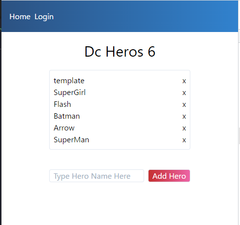

<!-- 11_DcHeros.md -->
# 11_DcHeros
- [DC Comics Hero](https://www.dccomics.com/characters)をリストアップするアプリ

## 利用機能
1. v-for
2. v-bind
3. v-model
4. v-on
5. methods
6. computed properties ( getters & setters)
<!-- 7. vue components -->

## 参照ソースの理解

### snapshot



### template
```HTML
<template>
  <div class="m-auto">
    <!-- herosCount: comptedオプションでリストのアイテム数を表示 -->
    <h1 class="text-3xl text-center my-4">Dc Heros {{ herosCount }}</h1>
    <ul class="border rounded p-2">
      <!-- li要素: v-forでdcHerosオブジェクトを表示する -->
      <li
        class="flex justify-between"
        v-for="(hero, index) in dcHeros"
        :key="hero.name"
      >
        <div>
          <!-- hero.name: v-bindでhero.nameを表示 -->
          {{ hero.name }}
        </div>
        <!-- button: removeメソッドで該当indexを削除・整理する -->
        <button v-on:click="remove(index)">x</button>
      </li>
    </ul>
    <!-- form: submitされたとき、addHeroメソッドでdcHeroオブジェクトに追加 -->
    <form class="mt-10" @submit.prevent="addHero">
      <!-- input: v-modelでnewHeroと連動。newHeroRefとも連動する -->
      <input
        class="border rounded px-2"
        v-model="newHero"
        placeholder="Type Hero Name Here"
        ref="newHeroRef"
      />
      <!-- button: type="submit"を発火して、form要素の動作を開始する -->
      <button
        class="border rounded bg-gradient-to-r from-red-700 to-pink-500 text-white ml-2 px-2"
        type="submit"
      >
        Add Hero
      </button>
    </form>
  </div>
</template>
```

### scriptタグ部分
```js
<script>
import { computed, onMounted, ref } from "vue";
export default {
  setup() {
    // newHeroRef: mountされたときに表示するデータ
    const newHeroRef = ref("");
    // newHero: v-modelでinput要素と連動するデータ
    const newHero = ref("");
    // dcHeros: リストで表示するデータ
    const dcHeros = ref([
      { name: "SuperGirl" },
      { name: "Flash" },
      { name: "Batman" },
      { name: "Arrow" },
      { name: "SuperMan" },
    ]);
    // mountされたとき、input要素にforcusする？
    onMounted(() => {
      newHeroRef.value.focus();
    });
    // heroCount: dcHerosオブジェクトのアイテム数をカウントする
    const herosCount = computed({
      get: () => dcHeros.value.length,
    });
    // remove: dcHerosオブジェクトの削除・整理処理
    function remove(index) {
      dcHeros.value = dcHeros.value.filter((hero, i) => i != index);
    }
    // addHero: dcHerosオブジェクトへの追加処理
    function addHero() {
      if (newHero.value !== "") {
        dcHeros.value.unshift({ name: newHero.value });
        newHero.value = "";
      }
    }
    //
    return { dcHeros, newHero, remove, addHero, newHeroRef, herosCount };
  },
};
</script>
```

### スタイルタグ
- bitfumesのアプリではtailwindを利用している
  - bootstrapではどのように実装できるかを確認してみる


## 実装作戦
- テンプレートー＞スクリプトを実装して動作確認
- スタイリングをあてる
