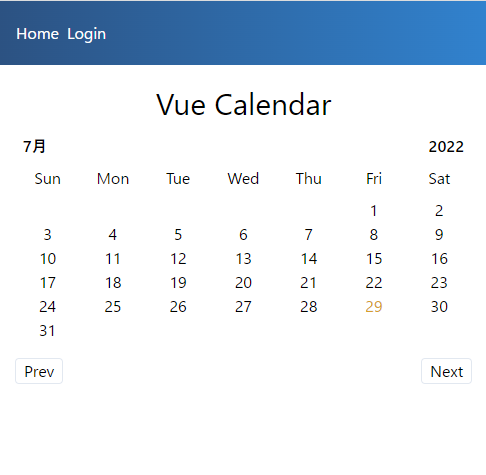

<!-- 12_Calendar.md -->
# 🔷 Calendar
- 月めくりのカレンダーアプリ

## 利用機能
1. Javascript Date
2. v-if
3. vue components

## 参照ソースの理解

### snapshot



### template
```html
<template>
  <div class="m-auto p-2">
    <h1 class="text-3xl my-2 text-center">Vue Calendar</h1>
    <!-- 月と年を左右に表示 -->
    <section class="mx-2 flex justify-between">
      <h2 class="font-bold">{{ currentMonthName }}</h2>
      <h2 class="font-bold">{{ currentYear }}</h2>
    </section>
    <!-- 日曜日から土曜日までの表示 -->
    <section class="flex my-2">
      <p
        class="text-center"
        style="width: 14.28%"
        v-for="day in days"
        :key="day"
      >
        {{ day }}
      </p>
    </section>
    <!-- 日を表示 -->
    <section class="flex flex-wrap">
      <!-- 第１週目の表示（１日の前に空白を入れる） -->
      <p
        class="text-center"
        style="width: 14.28%"
        v-for="num in startDay()"
        :key="num"
      ></p>
      <!-- ２週目以降の表示 -->
      <p
        class="text-center"
        style="width: 14.28%"
        v-for="num in daysInMonth()"
        :key="num"
        :class="currenDateClass(num)"
      >
        {{ num }}
      </p>
    </section>
    <!-- 前の月と次の月への遷移ボタンを左右に配置 -->
    <section class="flex justify-between my-4">
      <button class="px-2 border rounded" @click="prev">Prev</button>
      <button class="px-2 border rounded" @click="next">Next</button>
    </section>
  </div>
</template>
```

### scriptタグ部分
```js
<script>
export default {
  data() {
    return {
      // 現在時刻の年月日
      currentDate: new Date().getUTCDate(),
      currentMonth: new Date().getMonth(),
      currentYear: new Date().getFullYear(),
      // 曜日のラベル
      days: ["Sun", "Mon", "Tue", "Wed", "Thu", "Fri", "Sat"],
    };
  },
  methods: {
    // 指定年月の日数を取得
    daysInMonth() {
      return new Date(this.currentYear, this.currentMonth + 1, 0).getDate();
    },
    // 
    // 指定年月の１日目の曜日を取得
    startDay() {
      return new Date(this.currentYear, this.currentMonth, 1).getDay();
    },
    // 
    // 翌月への遷移
    next() {
      if (this.currentMonth === 11) {
        this.currentMonth = 0;
        this.currentYear++;
      } else {
        this.currentMonth++;
      }
    },
    // 
    // 前月への遷移
    prev() {
      if (this.currentMonth === 0) {
        this.currentMonth = 11;
        this.currentYear--;
      } else {
        this.currentMonth--;
      }
    },
    // 
    // 今日を黄色にする
    currenDateClass(num) {
      const calenderFullDate = new Date(
        this.currentYear,
        this.currentMonth,
        num
      ).toDateString();
      const currentFullDate = new Date().toDateString();
      return calenderFullDate === currentFullDate ? "text-yellow-600" : "";
    },
  },
  computed: {
    // 
    // 月の表示
    currentMonthName() {
      return new Date(
        this.currentYear,
        this.currentMonth
      ).toLocaleString("default", { month: "long" });
    },
  },
};
</script>
```

### スタイリング（tailwindの利用）
- bitfumesのアプリではtailwindを利用している
```css
<style></style>
```


## 実装作戦
- テンプレートーとスクリプトを参考に実装して、動作確認
  - compositionAPIで実装する
  - refer ics-media : https://ics.media/entry/220120/
- レイアウト・スタイリングは元ソースを参考にtailwindcssで指定
  - refer tailwindcss : https://tailwindcss.jp/docs/background-color
- 部品をコンポーネントに分ける
  - @/components/monthCalendar/calenarMonthLabel :　カレンダーの年月を表示
  - @/components/monthCalendar/calendarDayLabel :　カレンダーの曜日を表示
  - @/components/monthCalendar/calendarDateTable :　カレンダーの日付を表示（断念）
