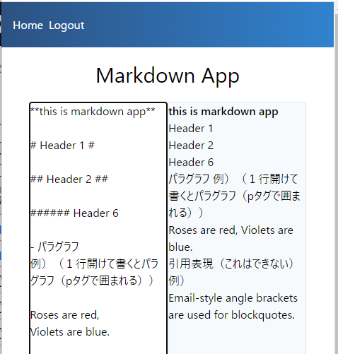

<!-- 13_Markdown.md -->
# 🔷 Markdown App
- （左欄に）Markdownを記入すると、（右欄に）HTMLを表示するアプリ

## 利用機能
1. v-for
2. v-bind
3. v-model
4. v-on
5. methods
6. computed properties ( getters & setters)
<!-- 7. vue components -->

## 参照ソースの理解

### snapshot



### template
```HTML
<template>
  <div class="flex flex-wrap w-full">
    <h1 class="w-full text-center text-3xl my-4">Markdown App</h1>
    <!-- アプリ本体の領域 -->
    <section class="flex m-auto w-10/12 h-screen">
      <!-- テキストエリアを設置 -->
      <article class="w-1/2 border">
        <textarea
          ref="markdownTextArea"
          class="w-full h-full"
          :value="text"
          @input="update"
        ></textarea>
      </article>
      <!-- v-htmlで結果を表示 -->
      <article class="w-1/2 border bg-gray-100" v-html="markedText"></article>
    </section>
  </div>
</template>
```

### scriptタグ部分
```js
<script>
// markedパッケージを読み込み
// refer npmjs : https://www.npmjs.com/package/marked
import marked from "marked";
// useDebounce : 遅延処理。独自に定義
import useDebounce from "../utilities/composition/useDebounce";
// 
export default {
  data() {
    return {
      text: "**this is markdown app**",
      debounce: "",
    };
  },
  computed: {
    markedText() {
      return marked(this.text);
    },
  },
  methods: {
    update(e) {
      const task = () => (this.text = e.target.value);
      this.debounce(task, 500);
    },
  },
  mounted() {
    this.debounce = useDebounce();
    this.$refs.markdownTextArea.focus();
  },
};
</script>
```

### Debounce処理の関数
```js
// utilities/composition/useDebounce.js
import { ref } from "vue";
export default function useDebounce() {
  const timeout = ref("");
  // funcをwait分遅延して実行する
  function debounce(func, wait = 1000) {
    clearTimeout(timeout.value);
    timeout.value = setTimeout(func, wait);
  }
  // Callback関数を返す
  return debounce;
}
```

### stylingタグ部分
- `tailwindcss`利用のため、スタリングなし
```css
<style></style>
```

## 実装作戦
1. `marked`パッケージをインストール
```
npm install marked --save
```
2. templateはコピー。scriptタグ部はCompositionAPIで実装する
3. `marked`パッケージのオプションを追加・施行してみる


