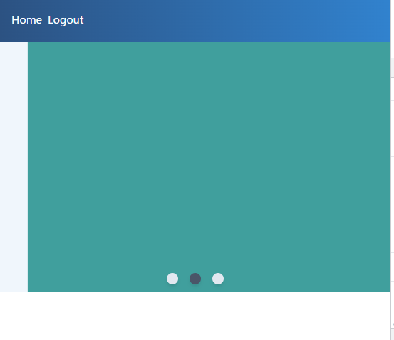

<!-- 14_Slider.md -->
# 🔷 Slider
- スライダー画面

## 利用機能
1. Vue Transition & Animation([`<Transition>`Component](https://vuejs.org/guide/built-ins/transition.html#the-transition-component))
2. virtual DOM ([rendering mechanism](https://vuejs.org/guide/extras/rendering-mechanism.html))
3. [lifecycle hooks](https://vuejs.org/guide/essentials/lifecycle.html)
  - (at Options API) [lifecycle hook API](https://vuejs.org/api/options-lifecycle.html)
  - (**at composition API**) [lifecycle hook](https://vuejs.org/api/composition-api-lifecycle.html)

## 参照ソースの理解

### snapshot



### template
```HTML
<template>
  <div class="flex flex-wrap w-full relative">
    <!-- TransitionComponentのテンプレート -->
    <div class="absolute w-full" v-for="(color, index) in sliders" :key="color">
      <!-- 追加スタリング用に"fade"がついたクラスをつける -->
      <transition name="fade">
        <!-- v-forのitemのうち、１itemのみ表示する -->
        <div
          v-if="currentSlide == index"
          :class="color"
          style="height:350px"
        ></div>
      </transition>
    </div>
    <div class="w-full" style="height:340px">
      <div class="absolute bottom-0 w-full flex justify-center">
        <!-- currentSlideのマークのみ色を変える -->
        <div
          v-for="(slider, index) in sliders"
          :key="slider"
          @click="makeActive(index)"
          :class="currentSlide == index ? 'bg-gray-700' : 'bg-gray-300'"
          class="w-4 h-4 mx-2 rounded-full cursor-pointer shadow-md"
        ></div>
      </div>
    </div>
    <!-- 下はボタンで表示／非表示のサンプル -->
    <!-- <div class="my-10 flex w-full">
      <div class="m-auto">
        <transition name="fade">
          <h1 v-if="isTitleShowing">Slider Carousel</h1>
        </transition>
        <button
          @click="isTitleShowing = !isTitleShowing"
          class="px-2 rounded border"
        >
          Toggle Text
        </button>
      </div>
    </div> -->
  </div>
</template>
```

### scriptタグ部分
```js
<script>
export default {
  data() {
    return {
      currentSlide: 1, // 表示スライドの位置
      sliders: ["bg-teal-600", "bg-blue-600", "bg-yellow-600"], // スライドアイテム
      interval: "",
      isTitleShowing: true, // タイトル表示の制御用
    };
  },
  methods: {
    makeActive(index) {
      this.currentSlide = index;
    },
  },
  // lifecycle hook で付属情報を初期化・クリーニングをする
  mounted() {
    this.interval = setInterval(() => {
      this.currentSlide = this.currentSlide === 2 ? 0 : this.currentSlide + 1;
    }, 2000);
  },
  beforeUnmount() {
    clearInterval(this.interval);
  },
};
</script>
```

### stylingタグ部分
- `tailwindcss`利用の上で、追加スタリング（`fade`で始まるクラスにつける）
```css
<style>
.fade-enter-active,
.fade-leave-active {
  transition: all 1s ease;
}
.fade-enter-from {
  opacity: 0;
  transform: translateX(-100%);
}
.fade-leave-to {
  opacity: 0;
  transform: translateX(100%);
}
</style>
```

## 実装作戦


