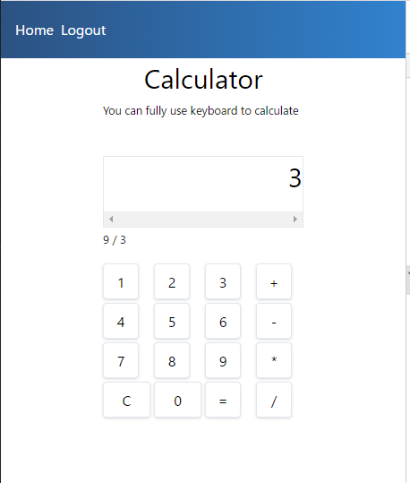

<!-- 16_Calculator.md -->
# 🔷 Calculator
- シンプル電卓アプリ

## 利用機能
1. Composition API
2. window event listener
3. resuable composition api

## 参照ソースの理解

### snapshot



### template
```html
<template>
  <section class="flex w-full">
    <div class="m-auto">
      <div>
        <h1 class="text-3xl text-center">Calculator</h1>
        <small>You can fully use keyboard to calculate</small>
      </div>
      <!-- 入力値と計算結果の表示枠 -->
      <p
        class="text-3xl text-right border mt-10 w-56 h-10 overflow-x-scroll"
        style="direction:rtl"
      >
        {{ currentNum }}
      </p>
      <!-- 演算子("selectedOperation")を入力されたときに計算式を表示する -->
      <div class="h-10">
        <small v-if="selectedOperation"
          >{{ prevNum }} {{ selectedOperation }} {{ currentNum }}</small
        >
      </div>
      <!-- ボタンをグリッドスタイルで表示。クリックイベントは"pressed(x)"で処理する -->
      <div class="grid grid-cols-4 gap-1">
        <button
          @click="pressed('1')"
          class="p-2 w-10 h-10 border rounded shadow"
        >
          1
        </button>
        <button
          @click="pressed('2')"
          class="p-2 w-10 h-10 border rounded shadow"
        >
          2
        </button>
        <button
          @click="pressed('3')"
          class="p-2 w-10 h-10 border rounded shadow"
        >
          3
        </button>
        <button
          @click="pressed('+')"
          class="p-2 w-10 h-10 border rounded shadow"
        >
          +
        </button>
        <button
          @click="pressed('4')"
          class="p-2 w-10 h-10 border rounded shadow"
        >
          4
        </button>
        <button
          @click="pressed('5')"
          class="p-2 w-10 h-10 border rounded shadow"
        >
          5
        </button>
        <button
          @click="pressed('6')"
          class="p-2 w-10 h-10 border rounded shadow"
        >
          6
        </button>
        <button
          @click="pressed('-')"
          class="p-2 w-10 h-10 border rounded shadow"
        >
          -
        </button>
        <button
          @click="pressed('7')"
          class="p-2 w-10 h-10 border rounded shadow"
        >
          7
        </button>
        <button
          @click="pressed('8')"
          class="p-2 w-10 h-10 border rounded shadow"
        >
          8
        </button>
        <button
          @click="pressed('9')"
          class="p-2 w-10 h-10 border rounded shadow"
        >
          9
        </button>
        <button
          @click="pressed('*')"
          class="p-2 w-10 h-10 border rounded shadow"
        >
          *
        </button>
        <button @click="pressed('c')" class="p-2 h-10 border rounded shadow">
          C
        </button>
        <button @click="pressed('0')" class="p-2 h-10 border rounded shadow">
          0
        </button>
        <button
          @click="pressed('=')"
          class="p-2 w-10 h-10 border rounded shadow"
        >
          =
        </button>
        <button
          @click="pressed('/')"
          class="p-2 w-10 h-10 border rounded shadow"
        >
          /
        </button>
      </div>
    </div>
  </section>
</template>
```

### scriptタグ部分
```js
<script>
import { ref } from "vue";
import useWindowEvent from "../utilities/composition/useWindowEvent";
export default {
  setup() {
    const operations = ["+", "-", "*", "/"];
    const numbers = ["1", "2", "3", "4", "5", "6", "7", "8", "9", "0"];
    const currentNum = ref(""); // 数値も文字列変数とする
    const prevNum = ref(""); // 数値も文字列変数とする
    const selectedOperation = ref("");
    // クリックイベントの処理：入力値で処理を振り分け宇
    function pressed(value) {
      if (value === "=" || value === "Enter") calculate();
      else if (value === "c") clear();
      else if (operations.includes(value)) applyOperation(value);
      else if (numbers.includes(value)) appendNumber(value);
    }
    // （数値入力時の処理）　数字の文字列のconcatをする
    function appendNumber(value) {
      currentNum.value = currentNum.value + value;
    }
    // （演算子入力時の処理）演算実行して、残りの変数をセットする
    // "v-if"ディレクティブにより、この時、計算式が表示される）
    function applyOperation(value) {
      calculate();
      prevNum.value = currentNum.value;
      currentNum.value = "";
      selectedOperation.value = value;
    }
    // （'='かENNTERの処理）演算実行
    function calculate() {
      if (selectedOperation.value === "*") multiply();
      else if (selectedOperation.value === "/") divide();
      else if (selectedOperation.value === "-") subtract();
      else if (selectedOperation.value === "+") sum();
      // 演算処理内で、"currentNum"は更新されるので、残りの変数を初期化する
      prevNum.value = "";
      selectedOperation.value = "";
    }
    // 演算処理："*", "/", "-", "+"
    function multiply() {
      currentNum.value = prevNum.value * currentNum.value;
    }
    function divide() {
      currentNum.value = prevNum.value / currentNum.value;
    }
    function subtract() {
      currentNum.value = prevNum.value - currentNum.value;
    }
    function sum() {
      currentNum.value = +prevNum.value + +currentNum.value;
    }
    // （クリア(C)入力時の処理）
    const clear = () => (currentNum.value = "");
    // キーボード入力時のイベントハンドラの設定
    // "useWindowEvent"関数内で、EventListenerへの登録・削除を定義している
    const handleKeydown = (e) => pressed(e.key);
    useWindowEvent("keydown", handleKeydown);
    //
    return { currentNum, pressed, selectedOperation, prevNum };
  },
};
</script>
```

#### 読み出し関数： 
- `useWindowEvent.js`：LifeCycleHook={ onMounted, onUnmounted } で登録・削除
```js
import { onMounted, onUnmounted } from "vue";
//
export default function useWindowEvent(eventName, handleEvent) {
  onMounted(() => window.addEventListener(eventName, handleEvent));
  onUnmounted(() => window.removeEventListener(eventName, handleEvent));
}
```

### スタイリング（tailwindの利用）
- bitfumesさんのアプリではtailwindを利用している
```css
<style></style>
```

## 実装作戦
- `<template>`内は、ボタンを`v-for`で表示したほうがすっきりしそう
  - 描画用に配列を定義（`panel_items=['1','2','3','+',...]`）
- `<script>`内は、CompositionAPIの実装を模倣する
