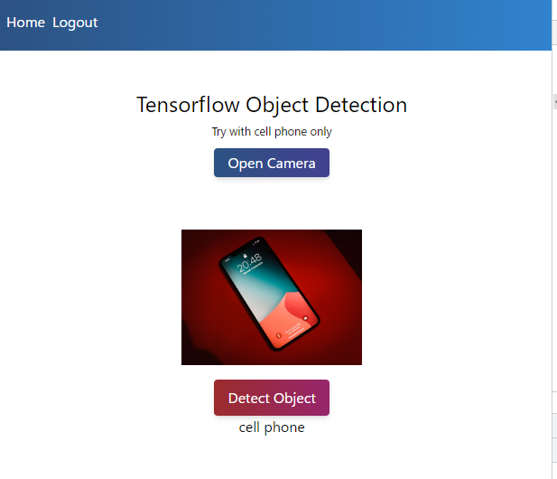

<!-- 20_TensorFlow.md -->
# 🔷 Tensorflow Object Detection
- カメラ画像から物体検出するアプリ

## 利用機能
1. Using Tensorflow with Vue
2. Device Camera Open
3. Working with Canvas

## 参照ソースの理解

### snapshot



### template
```html
<template>
  <section class="flex w-full">
    <div class="m-auto">
      <div class="mt-10">
        <div class="text-center w-full">
          <h1 class="text-2xl mt-4">Tensorflow Object Detection</h1>
          <small>Try with cell phone only</small>
        </div>
        <div class="flex flex-wrap justify-center my-2">
          <div class="w-full flex justify-center">
            <!-- カメラオフの時の表示ボタン -->
            <button
              v-if="!isStreaming"
              @click="openCamera"
              class="w-32 rounded shadow-md bg-gradient-to-r from-blue-800 to-indigo-800 text-white px-2 py-1"
            >
              Open Camera
            </button>
            <!-- カメラオンの時の表示ボタン -->
            <div v-else class="flex justify-between">
              <!-- カメラオフの指示ボタン -->
              <button
                @click="stopStreaming"
                class="w-32 rounded shadow-md bg-gradient-to-r from-blue-800 to-indigo-800 text-white px-2 py-1"
              >
                Stop Streaming
              </button>
              <!-- 画像取得の指示ボタン -->
              <button
                @click="snapshot"
                class="w-32 rounded shadow-md bg-gradient-to-r from-blue-800 to-indigo-800 text-white px-2 py-1"
              >
                Snapshot
              </button>
            </div>
          </div>
          <!-- videoタグで取得映像を表示。vueは`videoRef`変数より映像データ取得する -->
          <video ref="videoRef" autoplay="true" width="100" />
        </div>
        <div class="flex flex-wrap justify-center">
          <!-- imgタグで取得画像を表示。vue内で`imgRef`変数より物体検出用の画像を取得する -->
          
          <div class="w-full text-center my-4">
            <!-- 物体検出指示ボタン -->
            <button
              @click="detect"
              class="w-32 rounded shadow-md bg-gradient-to-r from-red-800 to-pink-800 text-white p-2"
            >
              <span v-if="isLoading">Loading ... </span>
              <span v-else>Detect Object</span>
            </button>
            <!-- 物体検出結果の表示 -->
            <div v-if="result.length > 0">
              <p>{{ result[0].class }}</p>
            </div>
          </div>
        </div>
      </div>
    </div>
  </section>
</template>
```

### scriptタグ部分
```js
<script>
import { ref } from "vue";
require("@tensorflow/tfjs-backend-cpu");
require("@tensorflow/tfjs-backend-webgl");
const cocoSsd = require("@tensorflow-models/coco-ssd");
export default {
  setup() {
    const imgRef = ref("");
    const videoRef = ref("");
    const isLoading = ref(false);
    const isStreaming = ref(false);
    const result = ref([]);
    // 物体検出のメソッド
    async function detect() {
      const img = imgRef.value;
      isLoading.value = true;
      const model = await cocoSsd.load();
      const predictions = await model.detect(img);
      result.value = predictions;
      console.log(predictions, img);
      isLoading.value = false;
    }
    // デバイスのカメラ有効化
    async function openCamera() {
      if (navigator.mediaDevices.getUserMedia) {
        const devices = await navigator.mediaDevices.enumerateDevices();
        const cams = devices.filter((device) => device.kind === "videoinput");
        const camId = cams[0].deviceId;
        const video = cams.length === 1 ? true : { deviceId: { exact: camId } };
        navigator.mediaDevices.getUserMedia({ video: video }).then((stream) => {
          isStreaming.value = true;
          videoRef.value.srcObject = stream;
        });
      }
    }
    // デバイスのカメラ無効化
    function stopStreaming() {
      const stream = videoRef.value.srcObject;
      const tracks = stream.getTracks();
      tracks.map((track) => track.stop());
      isStreaming.value = false;
    }
    // カメラ画像を取得
    function snapshot() {
      const canvas = document.createElement("canvas");
      const ctx = canvas.getContext("2d");
      ctx.drawImage(videoRef.value, 0, 0, 200, 200);
      const data = canvas.toDataURL("image/png");
      imgRef.value.setAttribute("src", data);
    }
    //
    return {
      imgRef,
      result,
      detect,
      isLoading,
      openCamera,
      videoRef,
      isStreaming,
      stopStreaming,
      snapshot,
    };
  },
};
</script>
```

### stylingタグ部分
- `tailwindcss`利用の上で、追加スタリング（`fade`で始まるクラスにつける）
```css
<style></style>
```

## 実装作戦


